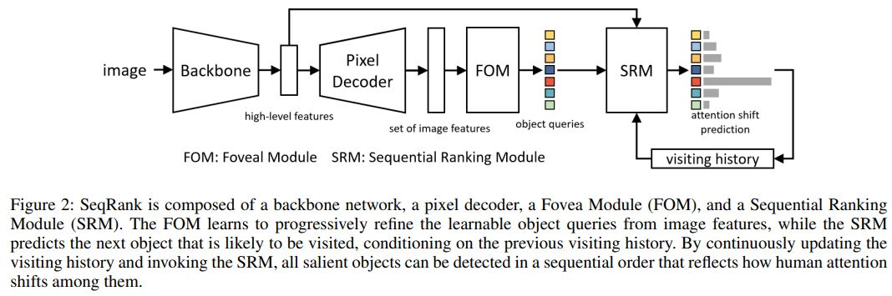
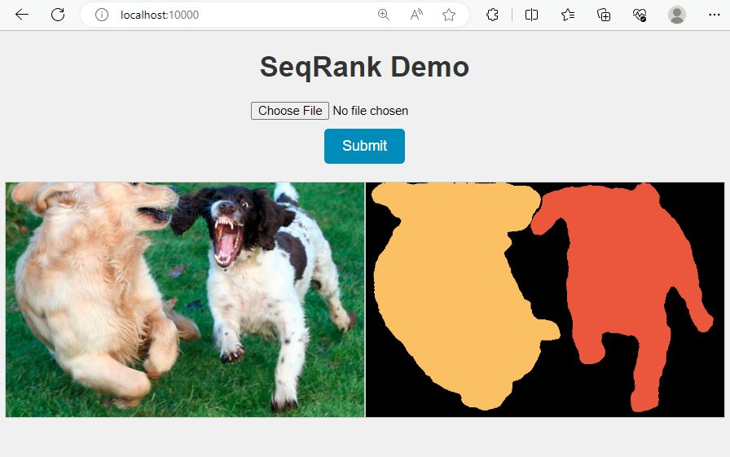
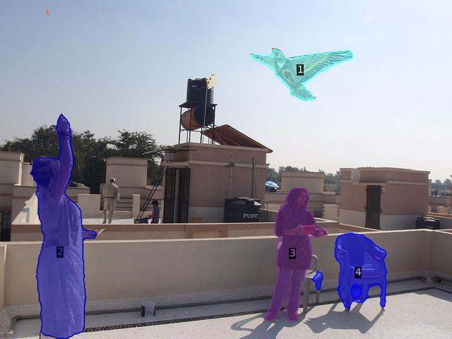
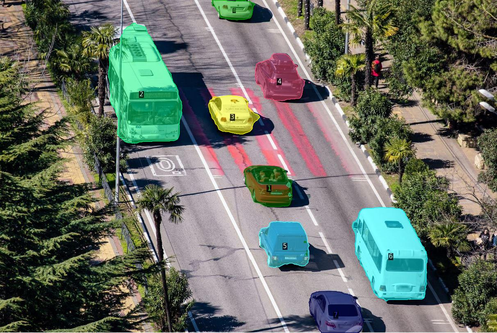
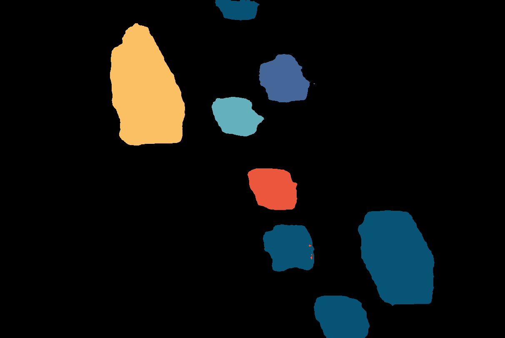

# Paper "SeqRank: Sequential Ranking of Salient Objects" (AAAI 2024)

> Huankang Guan and Rynson W.H. Lau   
> Department of Computer Science, City University of Hong Kong  
> Email: Huankang.Guan@my.cityu.edu.hk


A novel salient object ranking model detects & ranks salient objects in a sequential way, yielding more favorable results.

[[Paper]](https://1drv.ms/b/s!Ap4-mN9MwOE5gpZ9LlJZ6iP3VmhU0A?e=WVEoPs) [[Data]](https://github.com/guanhuankang/SeqRank/tree/main/assets/datasets) [[Results & Model Zoo]](https://github.com/guanhuankang/SeqRank/tree/main/assets/seqrank_results) [[Suppl]](doc/guan_seqrank_suppl.pdf) [[Poster]](doc/guan_seqrank_poster.pdf)

## 

Salient Object Ranking (SOR) is the process of predicting the order of an observer's attention to objects when viewing a complex scene. Existing SOR methods primarily focus on ranking various scene objects simultaneously by exploring their spatial and semantic properties. However, their solutions of **simultaneously** ranking all salient objects do not align with human viewing behavior, and may result in incorrect attention shift predictions. We observe that humans view a scene through a **sequential** and **continuous** process involving a cycle of foveating to objects of interest with our foveal vision while using peripheral vision to prepare for the next fixation location. For instance, when we see a flying kite, our foveal vision captures the kite itself, while our peripheral vision can help us locate the person controlling it such that we can smoothly divert our attention to it next. By repeatedly carrying out this cycle, we can gain a thorough understanding of the entire scene. Based on this observation, we propose to model the dynamic interplay between foveal and peripheral vision to predict human attention shifts sequentially. To this end, we propose a novel SOR model, SeqRank, which reproduces foveal vision to extract high-acuity visual features for accurate salient instance segmentation while also modeling peripheral vision to select the object that is likely to grab the viewer’s attention next. By incorporating both types of vision, our model can mimic human viewing behavior better and provide a more faithful ranking among various scene objects. Most notably, our model improves the SA-SOR/MAE scores by **+6.1%/-13.0%** on IRSR, compared with the state-of-the-art. Extensive experiments show the superior performance of our model on the SOR benchmarks. Code is available at https://github.com/guanhuankang/SeqRank.




## Install

1. Create a conda environment.

   ```shell
   conda create -n seqrank python=3.9 -y
   conda activate seqrank
   ```

2. Install packages. We develop SeqRank based on pytorch and detectron2.

   ```shell
   ## Pytorch & Detectron2
   pip3 install torch torchvision torchaudio
   python -m pip install 'git+https://github.com/facebookresearch/detectron2.git'
   
   ## Other packages
   pip install opencv-python==4.7.0.72
   pip install albumentations==1.3.0
   pip install pandas==2.0.1
   pip install scipy==1.9.1
   pip install timm==0.9.0
   pip install pycocotools
   
   pip uninstall Pillow -y
   pip install Pillow==9.3.0
   pip uninstall setuptools -y
   pip install setuptools==59.5.0
   ```

3. Clone repo.

   ```
   git clone https://github.com/guanhuankang/SeqRank.git
   cd SeqRank
   ```


## Quick Start - Web Demo

We provide a web demo for easy start. Download a checkpoint from our model zoo, e.g. [seqrank_irsr_swinL_ckp](https://drive.google.com/file/d/1PUSJLRxA9sIJoYXx0Si3TawoKvnLIU3o/view?usp=drive_link) and launch it by running:

```
sh launch.sh PATH_TO_CHECKPOINT
```

Then open the browser to enjoy the demo!



## Quick Start - Terminal

We provide a terminal demo for quick start. Download a checkpoint from our model zoo, e.g. [seqrank_irsr_swinL_ckp](https://drive.google.com/file/d/1PUSJLRxA9sIJoYXx0Si3TawoKvnLIU3o/view?usp=drive_link), and run:

```
cd demo
python demo.py \
   --config-file ../configs/swinL.yaml \
   --input examples/*.jpg \
   --output output \
   --opts MODEL.WEIGHTS seqrank_irsr_swinL_ckp.pth
```

Visualized             |  ColorMap
:-------------------------:|:-------------------------:
|||
| |  |


## Dataset Preparation
We train and evaluate SeqRank on two SOR benchmarks, ASSR and IRSR. We have put annotations into assets/datasets. You need to download images from both SOR benchmarks and place these images into assets/datasets/{assr/irsr}/images/{train&test&val}.


## Evaluation

We provide an easy tool for SOR evaluation. Please select a result file from [Results](https://github.com/guanhuankang/SeqRank/tree/main/assets/seqrank_results) to run the evaluation tool. For example, select SeqRank's results on ASSR benchmark and its path is [assets/seqrank_results/assr_swinL/seqrank_assr_swinL_results.pth](https://github.com/guanhuankang/SeqRank/blob/main/assets/seqrank_results/assr_swinL/seqrank_assr_swinL_results.pth). Run:

```
python -m scripts.evaluation_tool \
   --eval-only \
   --config-file configs/swinL.yaml \
   DATASETS.TEST "('assr_test',)" \
   MODEL.WEIGHTS assets/seqrank_results/assr_swinL/seqrank_assr_swinL_results.pth \
   OUTPUT_DIR output/seqrank_assr_swinL_results
```

Note that you need to specify the test set to get the correct sor scores. If you run the corrected versions, please choose swinL_correct.yaml, i.e. "--config-file configs/swinL_correct.yaml". We use MODEL.WEIGHTS to specify the path of the result file, which can be loaded by "torch.load".


## EasyTool for SOR Visualization

You can obtain visualization results using our sor visualization tool. For example, run the following code to visualize [seqrank_irsr_swinL_results.pth](https://github.com/guanhuankang/SeqRank/blob/main/assets/seqrank_results/irsr_swinL/seqrank_irsr_swinL_results.pth).

```
python -m scripts.visualize2colormap \
   -p assets/seqrank_results/irsr_swinL/seqrank_irsr_swinL_results.pth \
   -o output/seqrank_irsr_swinL_colormaps
```

## Train

1. Please make sure that you have completed 'Install' and 'Dataset Preparation' steps before you start to train SeqRank.

2. Download pretrained weight of swin-transformer backbone from our [google drive](https://drive.google.com/file/d/1zuxsowmxrR_1_MejfOxHD1D6_xAXhdir/view?usp=drive_link), and put it in assets/pretrained/swin_large_patch4_window12_384_22k.pth. If you download from Swin-Transformer github, you may need to convert it using pretrained/convert_backbone.py.

2. We train SeqRank on 4 A100 (80G):
```
python train_net.py \
   --num-gpu 4 \
   --config-file configs/swinL.yaml \
   SOLVER.IMS_PER_GPU 8 \
   INPUT.FT_SIZE_TRAIN 800 \
   INPUT.FT_SIZE_TEST 800 \
   SOLVER.STEPS "(20000,)" \
   SOLVER.MAX_ITER 30000 \
   DATASETS.TRAIN "('assr_train',)" \
   DATASETS.TEST "('assr_test',)" \
   OUTPUT_DIR output/assr_train
```
You can swith datasets by yourself. If you do not have multiple GPUs, set --num-gpu to 1 and SOLVER.IMS_PER_GPU to 24 or 32. If you encounter from insufficient GPU memory, we recommend to reduce the image resolution, e.g. ``` INPUT.FT_SIZE_TRAIN 384 INPUT.FT_SIZE_TEST 384 ```. Note that the batch size is calculated as SOVLER.IMS_PER_GPU $\times$ args.num_gpu. We recommand that the bacth size is 24 or larger. Reducing LOSS.NUM_POINTS to a smaller value could also help to save memory usage.

4. The checkpoint and result file will be saved to output folder.

## Inference

You can find SeqRank's checkpoint files in [checkpoints](https://github.com/guanhuankang/SeqRank/tree/main/assets/seqrank_results). Download checkpoints and run the inference. For example, download [seqrank_assr_swinL_ckp.pth](https://drive.google.com/file/d/1rWHEUlnCWweoYqdY9JvrHuts-2lmUr_B/view) (trained on ASSR) and run:
```
python train_net.py \
   --eval-only \
   --num-gpu 1 \
   --config-file configs/swinL.yaml \
   MODEL.WEIGHTS seqrank_assr_swinL_ckp.pth \
   DATASETS.TEST "('assr_test',)" \
   OUTPUT_DIR output/assr_inference/
```
You can check the sor scores in log.txt. Visualize the result file (output/assr_inference/assr_test_coco_format.pth) using our visualization tool. Make sure that you choose the correspondding testset to do evaluation.

## Cite
[bib format](cite_seqrank_guan.bib)
```
Guan, H., & Lau, R. W. (2024). SeqRank: Sequential Ranking of Salient Objects.
Proceedings of the AAAI Conference on Artificial Intelligence, 38(3), 1941-1949.
https://doi.org/10.1609/aaai.v38i3.27964
```

If you have any question or find some mistakes, post them via issue pannel or feel free to email me (Huankang.Guan@my.cityu.edu.hk)! Thanks!
